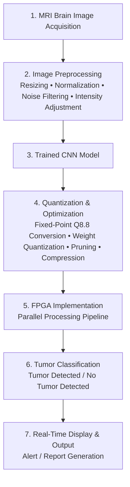
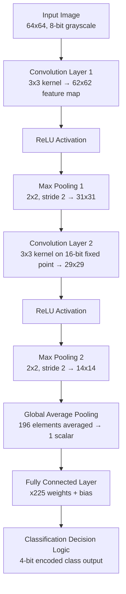

 

---

## 🔬 Abstract

This project delivers a hardware-accelerated solution for brain tumor detection by implementing a **Convolutional Neural Network (CNN) on FPGA hardware**. By exploiting the parallel-processing capabilities of FPGAs, the system supports real-time CNN inference with improved efficiency, while the flexibility of the FPGA fabric allows intricate CNN models to be mapped onto hardware for faster processing and reduced power consumption — key requirements for healthcare scenarios where rapid response times matter. The approach trains a CNN on brain MRI datasets, extracts the learned weights and biases, and implements the network layer-by-layer on FPGA — beginning with a single neuron as an initial validation step and progressing to the full pipeline. The project evaluates and compares implementations across CPU, GPU, and FPGA platforms, highlighting FPGA's superior speed and energy efficiency for portable diagnostics in resource-constrained environments.

<strong>🖼️ Click to view the equivalent flow as a Mermaid diagram</strong>

---

## ✅ Objectives

- **Real-Time Processing** — implement a hardware-accelerated CNN on FPGA for real-time analysis of brain MRI images.
- **High Accuracy and Efficiency** — design a CNN architecture with high diagnostic accuracy while balancing power consumption and computational performance on FPGA.
- **Scalable Hardware Design** — support deployment across various FPGA platforms and healthcare workloads.
- **Integration with Diagnostic Tools** — align the hardware implementation with practical diagnostic workflows for seamless integration with existing medical imaging systems.
- **Resource Optimization** — apply quantization, pruning, and efficient parameter storage to maximize FPGA resource utilization.
- **Sustainability and Cost-Efficiency** — prioritize energy efficiency to reduce environmental impact and enable deployment in low-resource settings.

## 📖 Literature Review

The intersection of FPGA hardware acceleration and CNN-based deep learning has drawn substantial research interest, particularly for real-time inference. Recurring themes across the literature include:

- FPGA-based implementations consistently show **energy efficiency and latency advantages** over CPU/GPU inference, largely due to parallel processing of convolutional layers.
- **Quantization** (reducing weight/activation bit-width) and **pruning** (removing redundant parameters) are the dominant optimization strategies for fitting CNNs within FPGA resource constraints (LUTs, BRAM, DSP slices).
- **Hardware-software co-design** and hardware-aware training help tailor CNN models specifically for FPGA deployment.
- **High-level synthesis (HLS) tools**, such as Xilinx Vivado HLS, have streamlined converting neural network models into hardware implementations.
- Open challenges remain around **scalability and generalization** when adapting large-scale CNNs to FPGA platforms; hybrid FPGA + cloud/edge approaches are suggested as a path forward.

---

## 🏗 System Architecture

### CNN Model Architecture (Software / Training)

### FPGA Hardware Pipeline (`cnn_top` — as implemented in Verilog)

The FPGA implementation processes a **flattened 64×64 grayscale MRI image** (8 bits/pixel, 32,768 bits total) through the following pipeline:

**Legend:** Weights and biases for each layer are read from external memory files via `$readmemh` and stored in internal registers for runtime use.

---

## 🧪 Methodology / Design Approach

The design follows a structured progression from software training to FPGA deployment:

| Stage | Description |
|-------|-------------|
| **1. Data Collection & Preprocessing** | Brain MRI scans (labeled tumor/no-tumor) are collected. Images are converted to grayscale, resized to a uniform dimension, and pixel intensities normalized to improve training efficiency. |
| **2. CNN Model Design & Training** | A CNN with multiple convolutional, pooling, and fully connected layers is built and trained in **TensorFlow** (on Google Colab), using backpropagation and gradient descent. Accuracy, precision, recall, and F1-score are tracked during training. |
| **3. Extraction of Weights & Biases** | Post-training, weights and biases are extracted from each layer and converted to **Q8.8 fixed-point** format for hardware compatibility. |
| **4. FPGA System Modeling** | The CNN layers (convolution, pooling, fully connected) are translated into FPGA-compatible Verilog modules. Neuron-level validation confirms hardware computations match software outputs. |
| **5. CNN Hardware Mapping** | The full architecture is mapped onto the FPGA by replicating neurons per layer and connecting layers to mirror the TensorFlow design, with optimizations for parallelism and reduced resource usage. |
| **6. Verification & Validation** | FPGA outputs are compared against the software CNN model to confirm functional correctness and timing alignment. |
| **7. Performance Analysis** | Classification accuracy, latency, power consumption, and FPGA resource usage (LUTs, flip-flops, DSP slices, BRAM) are measured and benchmarked against CPU/GPU implementations. |
| **8. Real-Time Testing & Refinement** | The system is tested with new MRI scans in a practical setting, with refinements applied to improve accuracy, speed, and overall performance. |

<strong>FPGA Design Flow (synthesis to bitstream)</strong>

1. **High-Level Design** — CNN architecture converted into hardware-friendly components (convolution, pooling, fully connected mapped to FPGA modules).
2. **Behavioral Simulation** — high-level simulation verifies each CNN layer's functionality against the software model.
3. **Synthesis** — Verilog code synthesized (Xilinx Vivado / Intel Quartus) into a gate-level netlist.
4. **Implementation** — design mapped onto physical FPGA resources (LUTs, Flip-Flops, DSPs, Block RAM) under timing constraints.
5. **Place and Route** — components placed and routed on the FPGA fabric to minimize delay and maximize performance.
6. **Configuration File Generation** — a bitstream is generated to program the FPGA.

---

## ⚙️ Verilog Module Breakdown

| Module | Responsibility |
|--------|-----------------|
| **`cnn_top`** | Top-level module coordinating the full CNN pipeline: Conv1 → ReLU → Pool1 → Conv2 → ReLU → Pool2 → Global Average Pooling → Fully Connected → Classification Decision Logic. |
| **`conv2d`** | Performs convolution over a 3×3 pixel window and corresponding weights; pixel values extended to 16 bits to match weight precision; multiply-accumulate is sequenced via an FSM across clock cycles; bias added and result scaled. |
| **`relu`** | Takes a 16-bit signed value; outputs zero if negative, otherwise passes the value through — introducing non-linearity. |
| **`max_pooling`** | Compares a 2×2 input window sequentially and stores/outputs the maximum value. |
| **`fully_connected`** | Multiplies the single scalar from global average pooling with 225 weights, sums with a bias (accumulated in a 32-bit register), then scales down to a 16-bit output. |

**Weight & bias storage:** extracted parameters are stored in **Block RAM (BRAM)** on the FPGA for fast access during inference, minimizing latency and improving memory efficiency.

**Resource optimization techniques used:**
- **Quantization** — reduces bit-width of weights/biases to cut memory and compute requirements.
- **Pruning** — removes redundant parameters to reduce model size without sacrificing accuracy.

 
<strong>Fig.</strong> RTL schematic of the synthesized CNN design, generated post-synthesis in the FPGA toolchain.

---

## 🧰 Hardware & Software Tools

| Category | Tool | Purpose |
|----------|------|---------|
| **Model Development** |  via **Google Colab** | CNN design and training with GPU acceleration |
| **Fixed-Point Conversion** | **MATLAB** | Converting extracted weights/biases to Q8.8 fixed-point format |
| **Hardware Description** | **Verilog HDL** | Defining and connecting CNN layers as FPGA modules |
| **FPGA Synthesis** |  / **Quartus Prime** | Synthesis, simulation, and programming of the CNN hardware design |
| **Target Board** | **Digilent Genesys 2 FPGA Board** | Selected for its parallel processing capability, DSP slices, and Block RAM |

---

## 📊 Results & Performance

### Per-Class Classification Accuracy

| Tumor Class | Accuracy |
|-------------|----------|
| Glioma | 0.80 |
| Meningioma | 0.90 |
| No Tumor | 0.90 |
| Pituitary | 0.70 |

### Summary Performance Metrics

| Metric | Value / Outcome | Remarks |
|--------|------------------|---------|
| **Model Accuracy** | **94.2%** | Slight reduction due to quantization and pruning on FPGA |
| **Processing Latency** | **~35 ms** per MRI image | Real-time processing capability achieved |
| **Power Consumption** | **~1.8 W** | Significantly lower than GPU-based implementations |
| **FPGA Resource Utilization** | LUTs: 78% • FFs: 71% • BRAMs: 64% • DSPs: 85% | Efficient use of FPGA resources with room for scaling |
| **Model Size after Optimization** | **1.3 MB** | Reduced via quantization and pruning |
| **Hardware Accuracy Deviation** | **±1.3%** | Relative to the original floating-point software model |

> [!NOTE]
> These summary metrics are as reported in the project poster. The verification methodology compared FPGA output against the software model via simulation and real-time testing with new MRI scans (see [Methodology](#-methodology--design-approach)).

---

## ⚠️ Limitations & Constraints

- **Resource limitations on FPGA** — the Genesys 2 board's restricted resources required quantization and pruning, which could slightly impact overall accuracy.
- **Fixed-point arithmetic precision** — Q8.8 quantization reduces precision relative to floating-point software CNNs, resulting in minor accuracy deviations.
- **Complexity in hardware mapping** — translating the CNN architecture into Verilog is labor-intensive and requires expertise, particularly when validating layer functionality for real-time performance.
- **Dataset limitations** — model performance and generalizability depend on the quality and variability of the MRI dataset used.

---

## 🌱 Social & Environmental Impact

**Social:**
- **Healthcare innovation** — real-time MRI tumor detection has life-saving potential through early, reliable diagnoses, and can extend diagnostic access to remote and underserved areas.
- **Safety in autonomous systems** — the same FPGA-accelerated CNN approach can improve real-time decision-making in domains like autonomous vehicles and robotics.
- **Economic and employment growth** — increasing adoption of AI hardware solutions drives demand for expertise in AI research, FPGA design, and software engineering.

**Environmental:**
- **Energy efficiency** — FPGA implementations are significantly more energy-efficient than CPU/GPU counterparts, supporting sustainable large-scale AI deployment.
- **Resource optimization** — quantization, pruning, and efficient memory management reduce the environmental footprint of high-complexity AI models.

---

## 🏁 Conclusion

This project designed and implemented a CNN on FPGA hardware for brain tumor detection with real-time processing capability. The workflow spanned data acquisition and preprocessing, CNN architecture development and training (TensorFlow / Google Colab), extraction and Q8.8 fixed-point conversion of model parameters (MATLAB), and hardware deployment in Verilog on a Genesys 2 FPGA board (via Xilinx Vivado). By leveraging parallel processing, the FPGA system achieves low-latency operation well-suited to real-time medical diagnostic applications, with evaluations showing strong performance across accuracy, latency, power efficiency, and resource utilization compared to traditional CPU/GPU implementations.

---

## 📚 References

1. Md. Najrul Islam, Rahul Shrestha, Shubhajit Roy Chowdhury. *"Energy-Efficient and High-Throughput CNN Inference Engine Based on Memory-Sharing and Data-Reusing for Edge Applications."* IEEE Transactions on Circuits and Systems.
2. Tao Jiang, Ligang Xing, Jinming Yu, Junchao Qian. *"A hardware-friendly logarithmic quantization method for CNNs and FPGA implementation."* IEEE Transactions on Circuits and Systems.
3. Sertaç Yaman, Barış Karakaya, Yavuz Erol. *"A novel normalization algorithm to facilitate pre-assessment of Covid-19 disease by improving accuracy of CNN and its FPGA implementation."* IEEE Transactions on Biomedical Engineering.
4. Sai Sanjeet, Bibhu Datta Sahoo, Masahiro Fujita. *"Energy-Efficient FPGA Implementation of Power-of-2 Weights-Based Convolutional Neural Networks With Low Bit-Precision Input Images."* IEEE Transactions on Circuits and Systems.
5. Rizwan Tariq Syed, Yanhua Zhao, Junchao Chen, Marko Andjelkovic, Markus Ulbricht, Milos Krstic. *"FPGA Implementation of a Fault-Tolerant Fused and Branched CNN Accelerator With Reconfigurable Capabilities."* IEEE Transactions on Circuits and Systems.
6. Ibrahim Fennouh, Said Sadoudi, Djamal Teguig, Camel Tanougast. *"FPGA implementation of orthogonal hyperchaotic sequences generator based on the CNN: application in multi-user chaotic communications."* IEEE Transactions on Circuits and Systems.
7. Daniel Enériz, Antonio J. Rodriguez-Almeida, Himar Fabelo, Samuel Ortega, Francisco J. Balea-Fernandez, Gustavo M. Callico, Nicolás Medrano, Belén Calvo. *"Low-Cost FPGA Implementation of Deep Learning-Based Heart Sound Segmentation for Real-Time CVDs Screening."*
8. Hiroshi Fuketa, Toshihiro Katashita, Yohei Hori, Masakazu Hioki. *"Multiplication-Free Lookup-Based CNN Accelerator Using Residual Vector Quantization and Its FPGA Implementation."*
9. Gianmarco Baldini, Fausto Bonavitacola, Jean-Marc Chareau. *"Wireless Interference Identification With Convolutional Neural Networks Based on the FPGA Implementation of the LTE Cell-Specific Reference Signal (CRS)."*
10. Chen Yang, Yizhou Wang, Xiaoli Wang, Li Geng. *"Energy-Efficient and High-Throughput CNN Inference Engine Based on Memory-Sharing and Data-Reusing for Edge Applications."*
11. Darío Baptista, F. Morgado-Dias, Leonel Sousa. *"A Platform based on HLS to Implement a Generic CNN on an FPGA."* 2019 International Conference in Engineering Applications (ICEA).
12. Meriam Dhouibi, Ahmed Karim Ben Salem, Slim Ben Saoud. *"CNN for object recognition implementation on FPGA using PYNQ framework."* 2020 IEEE Eighth International Conference on Communications and Networking (ComNet).
13. Federico G. Zacchigna. *"Methodology for CNN Implementation in FPGA-Based Embedded Systems."* IEEE Embedded Systems Letters.
14. Muhammad Arbab Arshad, Sakib Shahriar, Assim Sagahyroon. *"On the Use of FPGAs to Implement CNNs: A Brief Review."* 2020 International Conference on Computing, Electronics & Communications Engineering (iCCECE).

## 👤 Author

**Haridharan K S** 
B.Tech, Electronics and Communication Engineering
Vellore Institute of Technology (VIT), Chennai
Supported by **V-NEST** (VIT Chennai Startup and Research Foundation)

⭐ If you find this project useful, consider starring the repository!

